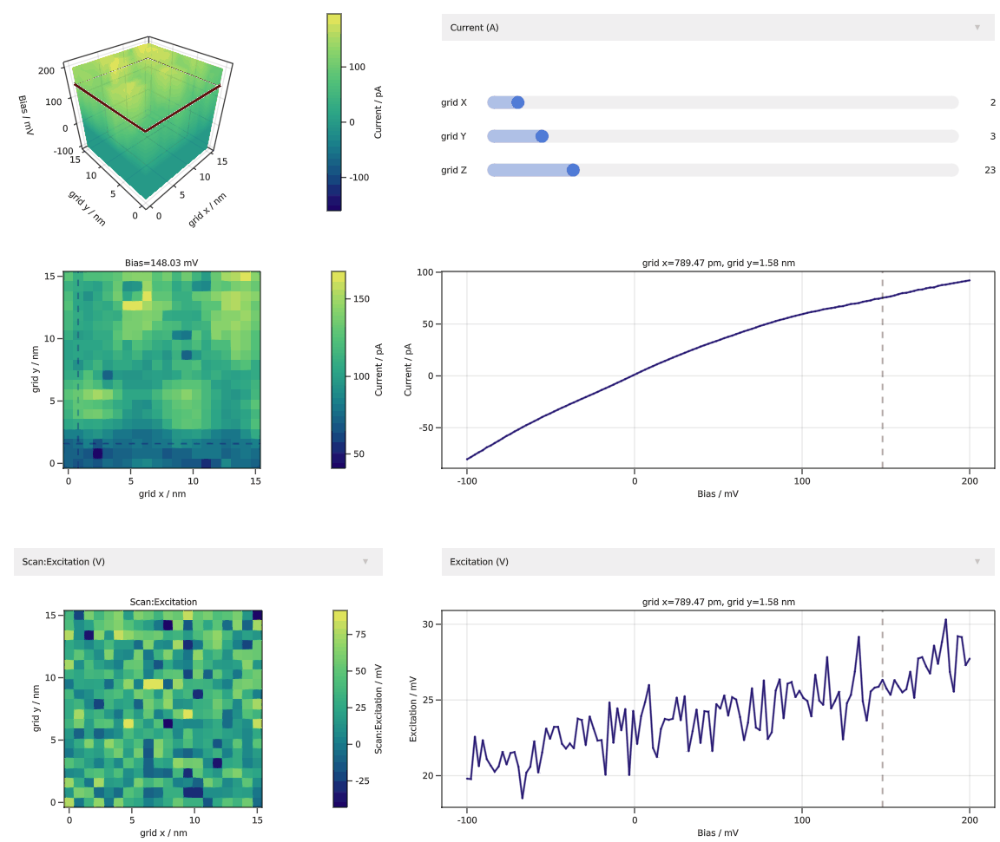

```@meta
CurrentModule = SpmGrids
```

# SpmGrids

Documentation for [SpmGrids](https://github.com/alexriss/SpmGrids.jl).

## About

A julia library to analyze scanning tuprobe microscopy grid data. Currently, only [Nanonis](https://www.specs-group.com/nanonis/products/) files are supported.

## Installation

SpmGrids can be installed from the Julia package registry via:

```julia
using Pkg
Pkg.add("SpmGrids")
```

Additionally, you need to install a [Makie backend](https://makie.juliaplots.org/stable/documentation/backends/).

```julia
using Pkg
Pkg.add("GLMakie")
```

## [Interactive widget](@id interactive_widget)

Now the fun begins. The easiest way to analyze grids is the interactive widget.

```julia
using SpmGrids
using GLMakie  # you can also use the WGLMakie backend

interactive_display("Bias_spectroscopy.3ds", colormap=:bluegreenyellow)
```



You can also easily create and adapt these plots in julia, as described in the [Tutorial](@ref tutorial_start).
