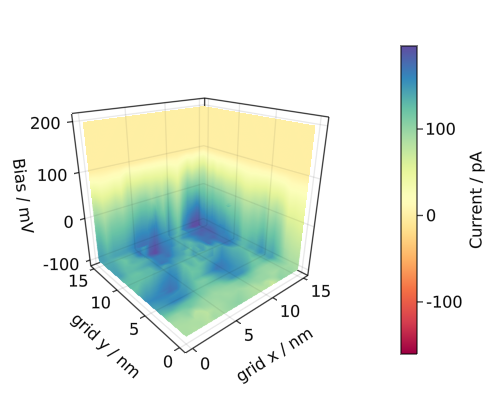

```@meta
CurrentModule = SpmGrids
```

# SpmGrids

Documentation for [SpmGrids](https://github.com/alexriss/SpmGrids.jl).

## About

A julia library to analyze scanning tuprobe microscopy grid data. Currently, only [Nanonis](https://www.specs-group.com/nanonis/products/) files are supported.

## Usage

### Loading data and parameters

```@repl
using SpmGrids
grid = load_grid("Bias_spectroscopy.3ds");

grid.experiment_parameters  # available parameter names
grid.channel_names  # available channel names
grid.size, grid.size_unit, grid.center, grid.angle, grid.pixelsize  # grid parameters
grid.start_time, grid.end_time  # more parameters
grid.header  # even more parameters

x = get_channel(grid, "Current", 5, 5);  # `Current` channel at point 5,5
x = get_channel(grid, "Current", :, 5);  # `Current` channel for 5th row
#  20th point of `Current` channel for 5th row
x = get_channel(grid, "Current", :, 5, 20);
x = get_channel(grid, grid.sweep_signal, 5, 6);  # sweep signal at point 5,6
p = get_parameter(grid, "Z offset", 3, 5);  # `Z offset` parameter at point 3,5

# get the first 50 points of the `Current` channel for 5th and 6th rows
x = get_channel(grid, "Current", :, 5:6, 1:50);
size(x) # 50 points of data for 20 columns and 2 rows
```

### Plotting spectra

```@example
using SpmGrids
using CairoMakie  # use any Makie backend you like

grid = load_grid("Bias_spectroscopy.3ds")

fig = Figure(resolution = (600, 300))
ax = Axis(fig[1, 1])

# line plot of `Current` vs `Bias` for all specified x and y indices
plot_spectrum(grid, "Bias", "Current", 10:12, 12, backend=CairoMakie)

fig
```

```@example
using SpmGrids
using CairoMakie

grid = load_grid("Bias_spectroscopy.3ds")

fig = Figure(resolution = (600, 300))
ax = Axis(fig[1, 1])

# x, y, as well as channel values can be indexed
plot_spectrum(grid, "Bias", "Frequency Shift", 8, 2:6, 20:120, backend=CairoMakie)

# add legend
fig[1, 2] = Legend(fig, ax, "Legend", framevisible=false)

fig
```

### Plotting lines

```@example
using SpmGrids
using CairoMakie

grid = load_grid("Z_spectroscopy.3ds")

fig = Figure(resolution = (800, 800));
ax = Axis(fig[1, 1])
# plot the `Frequency Shift` for 120th point in the sweep for the second row
plot_line(grid, "Frequency Shift", :, 2, 120, backend=CairoMakie)
fig[1, 2] = Legend(fig, ax, "", framevisible=false, labelsize=10)

ax = Axis(fig[2, 1])
# plot the `Frequency Shift` at point (2,3) against the sweep signal
# keywords (e.g. `color`) with be passed to the plot function for forward channel
plot_line(grid, "Frequency Shift", 2, 3, :, color="#a0a0a0", backend=CairoMakie)
fig[2, 2] = Legend(fig, ax, "", framevisible=false, labelsize=10)

ax = Axis(fig[3, 1])
# plot the `Frequency Shift` at point (3,2) against `Current` channel
# keywords with suffix `_bwd` (e.g. `color_bwd`) will be passed
# to the plot function for backward channel
plot_line(grid, "Frequency Shift", 3,2, :, sweep_channel="Current", color_bwd="#a0a0a0", backend=CairoMakie)
fig[3, 2] = Legend(fig, ax, "", framevisible=false, labelsize=10)

fig
```

### Plotting planes

```@example plane
using SpmGrids
using CairoMakie

grid = load_grid("Bias_spectroscopy.3ds")

fig = Figure(resolution = (800, 400));
g1 = fig[1, 1] = GridLayout()
g2 = fig[1, 2] = GridLayout()

ax1 = Axis(g1[1, 1])

# plot the `Frequency Shift` for 120th point in the sweep
hm1, cb_label1, label1 = plot_plane(grid, "Frequency Shift", :, :, 120,
    ax=ax1, backend=CairoMakie)
ax1.title = label1

# add colorbars
Colorbar(g1[1, 2], hm1, label=cb_label1)

fig
```

```@example plane
# add second plot
ax2 = Axis(g2[1, 1])

# plot `Current` values of the backward sweep
# for 10th to 100th point in the sweep for the 15th row
hm2, cb_label2, label2 = plot_plane(grid, "Current", :, 15, 1:100,
    ax=ax2, backward=true, colormap=:imola, backend=CairoMakie)
ax2.title = label2

Colorbar(g2[1, 2], hm2, label=cb_label2)

# mark 15th row in the first plot
px, py = xyindex_to_point(grid, 1, 15)
hlines!(ax1, py * 1e9, color=:red)  # we need to convert to nm

fig
```

_(Still need to figure out why the colorbars are not aligned.)_


### Plotting cubes

```julia
using SpmGrids
using GLMakie

grid = load_grid("Bias_spectroscopy.3ds")

fig = Figure(resolution = (500, 400));
ax = Axis3(fig[1, 1], perspectiveness=0.5)

vol, cb_label = plot_cube(grid, "Current", :, :, :,
    colormap=:Spectral_11, backend=GLMakie)
Colorbar(fig[1,2], vol, label=cb_label)

fig
```



All the plots can be interactive if you use the right [Makie backend](https://makie.juliaplots.org/stable/documentation/backends/).
## More information

A more detailed description can be found in the [Reference](@ref)
